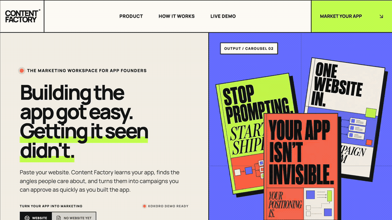
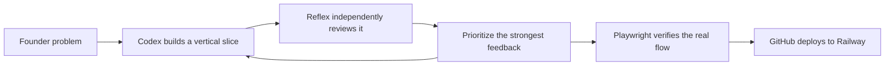

# Content Factory — Brand Studio for app founders

**One website → brand intelligence → hooks worth testing → campaigns ready to ship.**

[Launch the live demo](https://codex-hackathon-production.up.railway.app/) · [Open Brand Studio](https://codex-hackathon-production.up.railway.app/workspace) · [Browse Albums](https://codex-hackathon-production.up.railway.app/albums)

<p align="center">
  <a href="https://codex-hackathon-production.up.railway.app/">
    
  </a>
</p>

<p align="center"><strong>Click the walkthrough to try it live—no signup required.</strong></p>

Building an app is easier than ever. Getting people to notice it is still hard.

Content Factory turns one app website into an opinionated marketing system: brand identity, audience language, hooks worth testing, and campaigns ready to ship. A one-click Kokoro walkthrough is preloaded for judging.

## Why I built this

I am an app builder. I built [Kokoro](https://kokoromind.com/), a meditation app that creates something personal for the moment you are in and the goal you are trying to reach—not another generic recording library.

But building the product was only half the job. I do not have a giant paid-ads budget, and I do not have the time to become a full marketing team after spending the day building. I may have several apps to grow. For an independent founder, repeating research, ideation, scripting, design, publishing, and testing for every product is not sustainable.

That is why I built Content Factory: the marketing system I needed for myself, and the one I believe many other app founders need too. It learns the current app, understands the people behind the clicks and the problems they are trying to solve, finds promising content and format patterns, then turns those signals into tailored campaign ideas that can be tested instead of guessed.

UGC-style videos and swipeable photo carousels are the formats I keep seeing earn attention for apps on TikTok and Instagram. They are fast to test, native to the feed, and possible for a small founder to produce. Content Factory starts there, then carries the same brand intelligence into paid creative and founder-led posts.

| Discover | Decide | Ship |
| --- | --- | --- |
| Read the website, identity, audience language, and real customer tension. | Generate distinct hooks and let the founder keep or pass with a Tinder-like interaction. | Turn the winning angle into an organized campaign Album with slides, caption, and next formats. |

## 60-second judge walkthrough

1. Leave the gray `kokoromind.com` example untouched and click **Discover app**.
2. Watch the site become an editable Brand Studio with real identity and audience signals.
3. Swipe right to keep a hook and left to pass—the shortlist is saved as campaign context.
4. Click **Build carousel** to create a structured seven-slide draft.
5. Open **Albums** to browse the new draft and two finished campaign examples.

## Current milestone

- Editorial, responsive homepage
- Website or founder-description onboarding
- Live public-website discovery with SSRF protection
- Logo-aware Brand Studio for positioning, audience, proof, voice, and palette
- Live hook generation grounded in discovered brand signals
- Tinder-style selection with mouse, touch, buttons, and keyboard controls
- Kept hooks become real seven-slide carousel drafts
- Albums preserve slide order, visuals, captions, and campaign status
- Responsive, judge-friendly Kokoro demo

## Why the hook comes first

People decide whether to keep watching before they fully understand the product. Content Factory makes that high-leverage decision explicit: founders approve the promise first, then the same approved context shapes every output format.

## Stack

Next.js, React, TypeScript, Tailwind CSS, and self-hosted variable fonts.

## Run locally

```bash
npm install
npm run dev
```

Production verification:

```bash
npm run lint
npm run build
```

## Reflex × Runloop: our product-review partner

We treated [Reflex on Runloop](https://reflex.runloop.ai/) as a product partner throughout the hackathon—not a logo added at the end and not a runtime dependency. After core vertical slices, we returned to Reflex for an independent read on product clarity, usability, prioritization, and what would make the demo stronger. Codex then implemented the selected feedback and verified the result against the real deployed flow.



The next iteration makes that partnership a permanent product-development gate: Reflex reviews every milestone for demo clarity, failure states, accessibility, and mobile regressions; Codex implements and verifies the selected changes; the result is saved as an auditable build cycle. Reflex remains independent from the implementation agent, which is exactly why the feedback is valuable.

## Next milestone

Add authenticated GPT Image rendering for draft slides, performance learnings, and a publishing calendar—then use Reflex to compare the shipped result against the campaign brief.

## Development workflow

Built with Codex, reviewed through Reflex on Runloop, and deployed automatically from GitHub to Railway.
